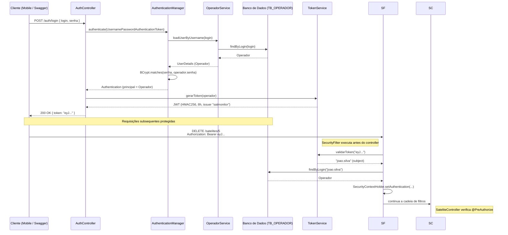
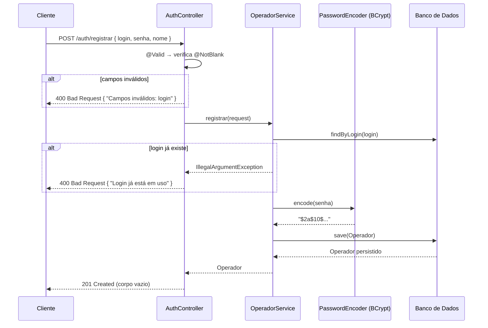

# Auth — Módulo de autenticação

## Índice

1. [Visão geral](#visão-geral)
2. [Estrutura de pacotes](#estrutura-de-pacotes)
3. [Diagrama de dependências](#diagrama-de-dependências)
4. [Entidade — Operador](#entidade--operador)
5. [DTOs](#dtos)
6. [Repository](#repository)
7. [Serviços](#serviços)
   - [TokenService](#tokenservice)
   - [OperadorService](#operadorservice)
8. [Filtro de segurança — SecurityFilter](#filtro-de-segurança--securityfilter)
9. [Configuração — SecurityConfig](#configuração--securityconfig)
10. [Controller — AuthController](#controller--authcontroller)
11. [Tratamento de erros](#tratamento-de-erros)
    - [ErroResponse](#erroresponse)
    - [Exceções de domínio](#exceções-de-domínio)
    - [GlobalExceptionHandler](#globalexceptionhandler)
12. [Fluxo completo de autenticação](#fluxo-completo-de-autenticação)
13. [Fluxo de registro](#fluxo-de-registro)
14. [Endpoints](#endpoints)
15. [Rotas públicas e protegidas](#rotas-públicas-e-protegidas)
16. [Variáveis de ambiente](#variáveis-de-ambiente)
17. [Decisões técnicas](#decisões-técnicas)
18. [Erros comuns](#erros-comuns)

---

## Visão geral

O SatMonitor usa **JWT (JSON Web Token)** com assinatura **HMAC256** para autenticar operadores. Não existe sessão no servidor — cada requisição é autônoma e carrega o próprio token.

**Ciclo de vida:**

1. **Registro** — `POST /auth/registrar` cria o operador com senha BCrypt.
2. **Login** — `POST /auth/login` valida as credenciais e devolve um JWT válido por **8 horas**.
3. **Uso** — o cliente anexa o token em `Authorization: Bearer <token>` em cada requisição protegida.
4. **Validação por requisição** — o `SecurityFilter` intercepta, extrai o token, verifica assinatura e validade, carrega o `Operador` e injeta a autenticação no contexto do Spring Security.
5. **Autorização** — rotas abertas são liberadas no `SecurityFilterChain`; autorização granular por role é feita via `@PreAuthorize` nos controllers de cada módulo.

---

## Estrutura de pacotes

```
br.com.fiap.satmonitor/
│
├── auth/
│   ├── entity/
│   │   └── Operador.java              # Entidade JPA + UserDetails
│   ├── dto/
│   │   ├── LoginRequest.java          # Corpo do POST /auth/login
│   │   ├── RegistroRequest.java       # Corpo do POST /auth/registrar
│   │   └── TokenResponse.java         # Resposta com o JWT
│   ├── repository/
│   │   └── OperadorRepository.java    # JPA + findByLogin
│   ├── service/
│   │   ├── TokenService.java          # Geração e validação de JWT
│   │   └── OperadorService.java       # UserDetailsService + registro
│   ├── security/
│   │   └── SecurityFilter.java        # Filtro OncePerRequestFilter
│   └── controller/
│       └── AuthController.java        # POST /auth/login e /registrar
│
├── config/
│   └── SecurityConfig.java            # SecurityFilterChain, beans de segurança
│
└── exception/
    ├── GlobalExceptionHandler.java    # @RestControllerAdvice centralizado
    ├── EntityNotFoundException.java   # RuntimeException → 404
    ├── AcessoNegadoException.java     # RuntimeException → 403
    └── ErroResponse.java              # Record padrão de erro
```

---

## Diagrama de dependências

```
AuthController
 ├── AuthenticationManager   (Spring Security — resolve UserDetailsService internamente)
 ├── TokenService             (gera JWT)
 └── OperadorService          (registra operador)
       ├── OperadorRepository
       └── PasswordEncoder    (bean de SecurityConfig)

SecurityFilter
 ├── TokenService             (valida JWT)
 └── OperadorRepository       (carrega Operador pelo login)

SecurityConfig
 └── SecurityFilter           (adiciona antes do UsernamePasswordAuthenticationFilter)
```

`SecurityConfig` nunca injeta `OperadorService` diretamente — o `AuthenticationManager` é obtido via `AuthenticationConfiguration`, que resolve o `UserDetailsService` (implementado por `OperadorService`) de forma automática. Isso evita dependência circular entre `SecurityConfig` → `OperadorService` → `PasswordEncoder` → `SecurityConfig`.

---

## Entidade — Operador

**Arquivo:** `auth/entity/Operador.java`  
**Tabela:** `TB_OPERADOR`  
**Sequence:** `SEQ_OPERADOR` (allocationSize = 1 — obrigatório para Oracle)

```java
@Entity
@Table(name = "TB_OPERADOR")
@Getter @Setter @NoArgsConstructor @AllArgsConstructor @Builder
public class Operador implements UserDetails { ... }
```

### Campos

| Campo | Coluna JPA         | Tipo   | Restrições              | Notas                                                         |
|-------|--------------------|--------|-------------------------|---------------------------------------------------------------|
| id    | `@Id` + `@GeneratedValue(SEQUENCE)` | Long   | PK                      | Sequence `SEQ_OPERADOR`, allocationSize=1                     |
| login | `@Column(unique, not null)` | String | único, obrigatório      | Serve como `username` no Spring Security                      |
| senha | `@Column(not null)` | String | obrigatório             | Sempre armazenada como hash BCrypt                            |
| nome  | `@Column(not null)` | String | obrigatório             | Nome de exibição                                              |
| role  | `@Column(not null)` | String | default `"OPERADOR"`    | `@Builder.Default` garante o valor mesmo ao usar o builder   |

### Por que `@Builder.Default` no campo `role`?

Sem `@Builder.Default`, o Lombok ignora o valor padrão `= "OPERADOR"` quando o objeto é criado via builder — o campo ficaria `null`. Com a anotação, `Operador.builder().login(...).build()` sempre produz `role = "OPERADOR"`.

### Implementação de UserDetails

O `Operador` implementa `UserDetails` para integração nativa com Spring Security:

| Método                      | Retorno              | Detalhe                                           |
|-----------------------------|----------------------|---------------------------------------------------|
| `getAuthorities()`          | `List<SimpleGrantedAuthority>` | Retorna `["ROLE_OPERADOR"]` (prefixo `ROLE_` adicionado) |
| `getPassword()`             | `senha`              | Hash BCrypt — anotado com `@JsonIgnore` para nunca ser serializado em JSON |
| `getUsername()`             | `login`              | Identificador único do operador                   |
| `isAccountNonExpired()`     | `true`               | Sem controle de expiração de conta                |
| `isAccountNonLocked()`      | `true`               | Sem bloqueio de conta                             |
| `isCredentialsNonExpired()` | `true`               | Sem rotação obrigatória de senha                  |
| `isEnabled()`               | `true`               | Operador sempre ativo                             |

---

## DTOs

### LoginRequest

**Arquivo:** `auth/dto/LoginRequest.java`

```java
public record LoginRequest(
    @NotBlank String login,
    @NotBlank String senha
) {}
```

Record imutável. `@NotBlank` rejeita strings nulas, vazias e com apenas espaços. Validado pelo Spring via `@Valid` no controller — falha em `MethodArgumentNotValidException`, tratada pelo `GlobalExceptionHandler` com HTTP 400.

---

### RegistroRequest

**Arquivo:** `auth/dto/RegistroRequest.java`

```java
public record RegistroRequest(
    @NotBlank String login,
    @NotBlank String senha,
    @NotBlank String nome
) {}
```

Mesmo contrato de validação que `LoginRequest`, com o campo `nome` adicional.

---

### TokenResponse

**Arquivo:** `auth/dto/TokenResponse.java`

```java
public record TokenResponse(String token) {}
```

Retornado pelo `POST /auth/login` com HTTP 200. O campo `token` contém o JWT completo — o cliente deve armazená-lo e enviá-lo em todas as requisições protegidas.

---

## Repository

**Arquivo:** `auth/repository/OperadorRepository.java`

```java
public interface OperadorRepository extends JpaRepository<Operador, Long> {
    Optional<Operador> findByLogin(String login);
}
```

Herda todos os métodos CRUD do `JpaRepository`. O método derivado `findByLogin` é gerado automaticamente pelo Spring Data JPA com base no nome — traduzido para `SELECT * FROM TB_OPERADOR WHERE LOGIN = ?`.

Usado em dois pontos distintos:
- `OperadorService.loadUserByUsername` — carrega o operador durante a autenticação no login.
- `SecurityFilter.doFilterInternal` — carrega o operador a partir do `login` extraído do JWT em cada requisição.

---

## Serviços

### TokenService

**Arquivo:** `auth/service/TokenService.java`  
**Biblioteca:** `com.auth0:java-jwt:4.4.0`

```java
@Slf4j
@Service
public class TokenService {
    private static final String ISSUER = "satmonitor";

    @Value("${api.security.token.secret}")
    private String secret;

    public String gerarToken(Operador operador) { ... }
    public String validarToken(String token) { ... }
}
```

O `secret` é injetado via `@Value` a partir de `application.properties`. Nunca está hardcoded na classe.

#### `gerarToken(Operador operador)`

Cria um JWT com os seguintes claims:

| Claim     | Valor                            | Descrição                                  |
|-----------|----------------------------------|--------------------------------------------|
| `iss`     | `"satmonitor"`                   | Issuer — identifica a aplicação emissora   |
| `sub`     | `operador.getLogin()`            | Subject — login do operador autenticado    |
| `exp`     | `Instant.now() + 8 horas`        | Expiração — token inválido após 8 horas    |
| assinatura | HMAC256 com `secret`            | Garante integridade e autenticidade        |

#### `validarToken(String token)`

1. Constrói um `JWTVerifier` que exige issuer `"satmonitor"` e verifica a assinatura HMAC256.
2. Chama `.verify(token)` — lança `JWTVerificationException` se o token expirou, foi adulterado ou tem issuer diferente.
3. Retorna o `subject` (login do operador) para que o `SecurityFilter` possa carregar o `Operador` do banco.
4. Em caso de exceção, loga um `WARN` e relança — o `SecurityFilter` captura e ignora, deixando a requisição prosseguir sem autenticação (Spring Security retornará 401 nas rotas protegidas).

---

### OperadorService

**Arquivo:** `auth/service/OperadorService.java`

```java
@Service
@RequiredArgsConstructor
public class OperadorService implements UserDetailsService {
    private final OperadorRepository operadorRepository;
    private final PasswordEncoder passwordEncoder;

    public UserDetails loadUserByUsername(String login) { ... }
    public Operador registrar(RegistroRequest req) { ... }
}
```

Implementa `UserDetailsService` — interface do Spring Security que o `DaoAuthenticationProvider` usa internamente para carregar o usuário durante o login via `AuthenticationManager.authenticate()`.

#### `loadUserByUsername(String login)`

Busca o operador pelo `login`. Lança `UsernameNotFoundException` se não encontrado — o Spring Security converte isso em `BadCredentialsException` internamente para não vazar se o login existe ou não (proteção contra enumeração de usuários).

#### `registrar(RegistroRequest req)`

1. Verifica se já existe um operador com o mesmo login → lança `IllegalArgumentException("Login já está em uso")` se sim. A mensagem é genérica e **não ecoa o login** informado (mitigação contra enumeração de usuários).
2. Cria um `Operador` via builder:
   - `login` vem direto do request.
   - `senha` é encriptada com `passwordEncoder.encode(req.senha())` — sempre BCrypt.
   - `nome` vem direto do request.
   - `role` usa o valor default `"OPERADOR"` via `@Builder.Default`.
3. Persiste e retorna o `Operador` salvo.

---

## Filtro de segurança — SecurityFilter

**Arquivo:** `auth/security/SecurityFilter.java`

```java
@Slf4j
@Component
@RequiredArgsConstructor
public class SecurityFilter extends OncePerRequestFilter {
    private final TokenService tokenService;
    private final OperadorRepository operadorRepository;

    @Override
    protected void doFilterInternal(...) { ... }

    private String extrairToken(HttpServletRequest request) { ... }
}
```

`OncePerRequestFilter` garante execução **exatamente uma vez** por requisição HTTP, mesmo em cenários com forward/include internos.

### `extrairToken(HttpServletRequest request)`

```
Header "Authorization" presente e começa com "Bearer "?
  Sim → retorna header.substring(7)   (remove o prefixo "Bearer ")
  Não → retorna null
```

Retornar `null` (em vez de lançar exceção) permite que requisições sem token cheguem às rotas públicas normalmente.

### `doFilterInternal(...)` — passo a passo

```
1. extrairToken(request)
   ↓ null → pula para filterChain.doFilter (sem autenticação)
   ↓ token presente

2. tokenService.validarToken(token)
   ↓ JWTVerificationException → log WARN + pula (sem autenticação)
   ↓ retorna login (subject do JWT)

3. operadorRepository.findByLogin(login)
   ↓ não encontrado → ifPresent não executa (sem autenticação)
   ↓ encontrado → operador

4. new UsernamePasswordAuthenticationToken(operador, null, operador.getAuthorities())
   SecurityContextHolder.getContext().setAuthentication(auth)

5. filterChain.doFilter(request, response)
   → requisição continua para o controller
```

**Ponto importante:** o filtro nunca interrompe a cadeia — sempre chama `filterChain.doFilter`. Se a autenticação falhar, a requisição continua sem identidade e o Spring Security retorna 401 nas rotas que exigem `authenticated()`.

### Posição na cadeia de filtros

`SecurityConfig` registra o `SecurityFilter` **antes** do `UsernamePasswordAuthenticationFilter`:

```java
.addFilterBefore(securityFilter, UsernamePasswordAuthenticationFilter.class)
```

Isso garante que o contexto de segurança já está populado quando o filtro padrão executa.

---

## Configuração — SecurityConfig

**Arquivo:** `config/SecurityConfig.java`

```java
@Configuration
@EnableWebSecurity
@EnableMethodSecurity
@RequiredArgsConstructor
public class SecurityConfig { ... }
```

### `@EnableMethodSecurity`

Ativa suporte a anotações de segurança em métodos — `@PreAuthorize`, `@PostAuthorize`, `@Secured`. Os controllers dos módulos `missao/`, `satelite/`, `sensor/` e `leitura/` usarão `@PreAuthorize` para verificar roles específicas de missão.

### Bean `SecurityFilterChain`

```java
http
  .csrf(csrf -> csrf.disable())
  .sessionManagement(s -> s.sessionCreationPolicy(STATELESS))
  .headers(h -> h.frameOptions(f -> f.sameOrigin()))
  .authorizeHttpRequests(auth -> auth
      .requestMatchers(POST, "/auth/login", "/auth/registrar").permitAll()
      .requestMatchers(GET, "/satelites/**", "/sensores/**", "/leituras/**").permitAll()
      .requestMatchers(POST, "/leituras").permitAll()
      .requestMatchers("/h2-console/**", "/swagger-ui/**", "/swagger-ui.html", "/v3/api-docs/**", "/actuator/health").permitAll()
      .anyRequest().authenticated()
  )
  .addFilterBefore(securityFilter, UsernamePasswordAuthenticationFilter.class)
```

| Decisão                          | Motivo                                                                      |
|----------------------------------|-----------------------------------------------------------------------------|
| `csrf.disable()`                 | API REST stateless — não usa cookies de sessão, CSRF não se aplica          |
| `STATELESS`                      | Sem `HttpSession` — cada requisição é autenticada pelo JWT, sem estado no servidor |
| `frameOptions.sameOrigin()`      | Permite que o H2 Console (que usa `<iframe>`) funcione no browser           |
| `requestMatchers(GET, ...)`      | GETs de satélites, sensores e leituras são públicos. **`GET /missoes/**` NÃO é público** — depende do operador logado, então exige token. POST/PUT/DELETE de entidades exigem autenticação |
| `requestMatchers(POST, "/leituras")` | O ESP32 (IoT) posta leituras sem token JWT — endpoint obrigatoriamente público |
| `anyRequest().authenticated()`   | Tudo que não foi explicitamente liberado exige token válido                 |

### Bean `PasswordEncoder`

```java
@Bean
public PasswordEncoder passwordEncoder() {
    return new BCryptPasswordEncoder();
}
```

BCrypt com fator de custo padrão (10). O bean é definido aqui e injetado no `OperadorService` via construtor.

### Bean `AuthenticationManager`

```java
@Bean
public AuthenticationManager authenticationManager(AuthenticationConfiguration config) throws Exception {
    return config.getAuthenticationManager();
}
```

`AuthenticationConfiguration` cria internamente um `DaoAuthenticationProvider` que usa o `OperadorService` (como `UserDetailsService`) e o `PasswordEncoder` (como `BCryptPasswordEncoder`). O `AuthController` usa esse bean para autenticar no login.

---

## Controller — AuthController

**Arquivo:** `auth/controller/AuthController.java`  
**Base path:** `/auth`

```java
@RestController
@RequestMapping("/auth")
@Tag(name = "Auth", description = "Autenticação e registro de operadores")
@RequiredArgsConstructor
public class AuthController {
    private final AuthenticationManager authenticationManager;
    private final TokenService tokenService;
    private final OperadorService operadorService;
}
```

### `POST /auth/login`

```
Entrada:  LoginRequest  { login, senha }
Saída:    TokenResponse { token }
HTTP:     200 OK
```

**Passo a passo interno:**

```
1. Cria UsernamePasswordAuthenticationToken(login, senha)
2. authenticationManager.authenticate(authToken)
     → DaoAuthenticationProvider.loadUserByUsername(login)
     → verifica BCrypt(senha) contra operador.senha
     → lança BadCredentialsException se inválido → GlobalExceptionHandler retorna 401 "Credenciais inválidas"
3. auth.getPrincipal() → cast para Operador
4. tokenService.gerarToken(operador) → JWT assinado
5. ResponseEntity.ok(new TokenResponse(token))
```

### `POST /auth/registrar`

```
Entrada:  RegistroRequest  { login, senha, nome }
Saída:    (corpo vazio)
HTTP:     201 Created
```

**Passo a passo interno:**

```
1. @Valid valida @NotBlank nos campos → 400 se inválido
2. operadorService.registrar(request)
     → verifica duplicidade de login → 400 se existir
     → BCrypt.encode(senha)
     → salva no banco
3. ResponseEntity.status(201).build()
```

---

## Tratamento de erros

### ErroResponse

**Arquivo:** `exception/ErroResponse.java`

```java
public record ErroResponse(
    LocalDateTime timestamp,
    int status,
    String error,
    String path
) {}
```

Todos os handlers do `GlobalExceptionHandler` retornam esse record. Exemplo de resposta:

```json
{
  "timestamp": "2026-06-02T14:23:07.412",
  "status": 400,
  "error": "Login já está em uso",
  "path": "/auth/registrar"
}
```

---

### Exceções de domínio

| Classe                   | Estende         | HTTP mapeado | Quando usar                                      |
|--------------------------|-----------------|:------------:|--------------------------------------------------|
| `EntityNotFoundException`| `RuntimeException` | 404       | Entidade não encontrada por ID (todos os módulos) |
| `AcessoNegadoException`  | `RuntimeException` | 403       | Operador sem role suficiente para a operação     |

Ambas são `unchecked` — podem ser lançadas de qualquer camada sem declaração em assinatura de método.

---

### GlobalExceptionHandler

**Arquivo:** `exception/GlobalExceptionHandler.java`

```java
@RestControllerAdvice
public class GlobalExceptionHandler { ... }
```

`@RestControllerAdvice` intercepta exceções de todos os controllers da aplicação antes que o Spring gere uma resposta de erro padrão.

| Handler                  | Exceção capturada                  | HTTP | Campo `error`                                    |
|--------------------------|------------------------------------|:----:|--------------------------------------------------|
| `handleEntityNotFound`   | `EntityNotFoundException`          | 404  | Mensagem da exceção                              |
| `handleAcessoNegado`     | `AcessoNegadoException`            | 403  | Mensagem da exceção                              |
| `handleSenhaMissaoInvalida` | `SenhaMissaoInvalidaException`  | 401  | Mensagem da exceção                              |
| `handleOperadorJaMembro` | `OperadorJaMembroException`        | 409  | Mensagem da exceção                              |
| `handleDonoUnico`        | `DonoUnicoException`               | 400  | Mensagem da exceção                              |
| `handleValidation`       | `MethodArgumentNotValidException`  | 400  | `"campo: mensagem; campo: mensagem"`             |
| `handleNotReadable`      | `HttpMessageNotReadableException`  | 400  | `"Corpo da requisição inválido ou mal formatado"` |
| `handleIllegalArgument`  | `IllegalArgumentException`         | 400  | Mensagem da exceção                              |
| `handleAccessDenied`     | `AccessDeniedException`            | 403  | `"Acesso negado"`                                |
| `handleAuthentication`   | `AuthenticationException`          | 401  | `"Credenciais inválidas"`                        |
| `handleGeneric`          | `Exception`                        | 500  | `"Erro interno no servidor"`                     |

O handler `handleGeneric` é o fallback final — captura qualquer exceção não tratada pelos handlers mais específicos. A mensagem genérica é intencional para não vazar detalhes de implementação ao cliente.

**Sobre `handleValidation`:**  
O Spring lança `MethodArgumentNotValidException` quando `@Valid` falha. O handler extrai cada campo com erro via `getBindingResult().getFieldErrors()` e os concatena como `"campo: mensagem"` separados por `; `.

**Sobre `handleNotReadable`:**  
Captura corpo JSON malformado ou valor de enum inválido (ex.: `tipo` de sensor desconhecido) — antes esses casos caíam no `handleGeneric` e retornavam 500.

**Sobre `handleAuthentication`:**  
Captura falhas de login (`BadCredentialsException`, usuário inexistente) com resposta idêntica `401 "Credenciais inválidas"` — não permite distinguir "usuário não existe" de "senha errada" (anti-enumeração).

---

## Fluxo completo de autenticação



---

## Fluxo de registro



---

## Endpoints

### POST /auth/login

| Campo          | Valor                          |
|----------------|--------------------------------|
| URL            | `POST /auth/login`             |
| Autenticação   | Não                            |
| Content-Type   | `application/json`             |
| Resposta OK    | `200 OK`                       |

**Corpo da requisição:**
```json
{
  "login": "joao.silva",
  "senha": "minhasenha123"
}
```

**Resposta 200:**
```json
{
  "token": "eyJhbGciOiJIUzI1NiIsInR5cCI6IkpXVCJ9.eyJpc3MiOiJzYXRtb25pdG9yIiwic3ViIjoiam9hby5zaWx2YSIsImV4cCI6MTc0ODg4MTYwMH0.abc123"
}
```

**Resposta 400** (campo em branco):
```json
{
  "timestamp": "2026-06-02T14:23:07.412",
  "status": 400,
  "error": "Campos inválidos: senha",
  "path": "/auth/login"
}
```

**Resposta 401** (credenciais erradas — tratada pelo `GlobalExceptionHandler` via `handleAuthentication`):
```json
{
  "timestamp": "2026-06-02T14:23:07.412",
  "status": 401,
  "error": "Credenciais inválidas",
  "path": "/auth/login"
}
```

---

### POST /auth/registrar

| Campo          | Valor                          |
|----------------|--------------------------------|
| URL            | `POST /auth/registrar`         |
| Autenticação   | Não                            |
| Content-Type   | `application/json`             |
| Resposta OK    | `201 Created` (corpo vazio)    |

**Corpo da requisição:**
```json
{
  "login": "joao.silva",
  "senha": "minhasenha123",
  "nome": "João Silva"
}
```

**Resposta 400** (login duplicado):
```json
{
  "timestamp": "2026-06-02T14:23:07.412",
  "status": 400,
  "error": "Login já está em uso",
  "path": "/auth/registrar"
}
```

---

## Rotas públicas e protegidas

### Rotas públicas (sem token)

Configuradas em `SecurityConfig.securityFilterChain` com `.permitAll()`:

| Método      | Rota                   | Motivo                                              |
|:-----------:|------------------------|-----------------------------------------------------|
| `POST`      | `/auth/login`          | Endpoint de autenticação — precisa ser público      |
| `POST`      | `/auth/registrar`      | Cadastro — precisa ser público                      |
| `GET`       | `/satelites/**`        | Leitura pública                                     |
| `GET`       | `/sensores/**`         | Leitura pública                                     |
| `GET`       | `/leituras/**`         | Leitura pública                                     |
| `POST`      | `/leituras`            | ESP32 (IoT) posta leituras sem gerenciar tokens     |
| `GET`       | `/actuator/health`     | Health check do container                          |
| qualquer    | `/h2-console/**`       | Console H2 — apenas desenvolvimento local (desabilitado em prod) |
| qualquer    | `/swagger-ui/**`       | Documentação interativa                             |
| qualquer    | `/swagger-ui.html`     | Redirect do Springdoc                               |
| qualquer    | `/v3/api-docs/**`      | Schema OpenAPI                                      |

> **`GET /missoes/**` NÃO é público:** diferentemente dos outros módulos, os GETs de missões dependem do operador logado (`@AuthenticationPrincipal`) para filtrar/validar o vínculo, então exigem token.

### Rotas protegidas

Tudo que não está na lista acima exige autenticação (`anyRequest().authenticated()`). Exemplos:

| Método      | Rota                          | Exige               |
|:-----------:|-------------------------------|---------------------|
| `GET`       | `/missoes/**`                 | Token válido        |
| `POST`      | `/missoes`                    | Token válido        |
| `PUT`       | `/missoes/{id}`               | Token + role DONO   |
| `DELETE`    | `/satelites/{id}`             | Token + role DONO   |
| `POST`      | `/satelites`                  | Token + role SUPERVISOR |
| `DELETE`    | `/leituras/{id}`              | Token + role SUPERVISOR |

As verificações de role (DONO, SUPERVISOR, MEMBRO) são implementadas com `@PreAuthorize` nos controllers de cada módulo de domínio, usando `@EnableMethodSecurity` habilitado no `SecurityConfig`.

---

## Variáveis de ambiente

| Variável de ambiente | Usada em             | Descrição                                                              |
|----------------------|----------------------|------------------------------------------------------------------------|
| `JWT_SECRET`         | secret HMAC256 do JWT | String longa e aleatória para assinar/verificar tokens. **Obrigatória em produção.** |
| `ORACLE_URL`         | datasource (prod)    | URL JDBC do Oracle FIAP                                                |
| `ORACLE_USER`        | datasource (prod)    | Usuário Oracle                                                        |
| `ORACLE_PASSWORD`    | datasource (prod)    | Senha Oracle                                                          |

### Desenvolvimento (`application.properties`)

Usa H2 em memória. O secret tem um fallback de dev (o `${JWT_SECRET:...}` resolve para o default quando a variável não está definida):

```properties
api.security.token.secret=${JWT_SECRET:satmonitor-dev-secret-local-2024}
```

### Produção (`application-prod.properties`, ativar com `SPRING_PROFILES_ACTIVE=prod`)

Tudo vem de variável de ambiente — **sem fallback no secret** (`${JWT_SECRET}`), então a aplicação **não sobe** se a variável não estiver definida (fail-fast). O console H2 fica desabilitado e `show-sql=false`. O arquivo só contém placeholders `${...}`, portanto é seguro versioná-lo.

```properties
api.security.token.secret=${JWT_SECRET}
spring.datasource.url=${ORACLE_URL}
spring.datasource.username=${ORACLE_USER}
spring.datasource.password=${ORACLE_PASSWORD}
```

---

## Decisões técnicas

### Por que CSRF desabilitado?

CSRF protege contra ataques onde um browser envia requisições autenticadas por cookie sem o usuário saber. Como esta API usa JWT em header (`Authorization: Bearer`), não usa cookies, e sessão é stateless — CSRF não se aplica.

### Por que stateless?

Sem estado no servidor: a API pode escalar horizontalmente sem sincronizar sessões entre instâncias. Cada requisição é autossuficiente com seu JWT.

### Por que `frameOptions.sameOrigin()`?

O H2 Console usa `<iframe>` para renderizar a UI. Por padrão, Spring Security bloqueia iframes com `X-Frame-Options: DENY`. `sameOrigin()` permite iframes da mesma origem, habilitando o console sem comprometer a segurança em produção (o H2 não existe em produção).

### Por que `@Builder.Default` no campo `role`?

Lombok Builder ignora inicializadores de campo por padrão — sem `@Builder.Default`, `role` seria `null` ao usar `Operador.builder().build()`. A anotação preserva o default `"OPERADOR"`.

### Por que `allocationSize = 1` na sequence?

O Oracle não suporta `GenerationType.IDENTITY`. Sequences são a abordagem correta. `allocationSize = 1` força o Hibernate a consultar o banco a cada insert em vez de pré-alocar um bloco — necessário para garantir que os IDs reflitam a sequence real do Oracle sem gaps inesperados.

### Por que `SecurityFilter` usa `OperadorRepository` em vez de `OperadorService`?

O `SecurityFilter` só precisa carregar o `Operador` pelo login — uma operação de leitura simples. Injetar o `OperadorService` traria a dependência do `PasswordEncoder` sem necessidade. Usar o repository diretamente é mais direto e evita acoplamento desnecessário.

### Por que injeção via construtor (`@RequiredArgsConstructor`)?

Injeção por campo com `@Autowired` oculta dependências, dificulta testes unitários e pode mascarar acoplamento excessivo. Injeção via construtor torna as dependências explícitas e permite usar `final` nos campos, garantindo imutabilidade da referência após construção.

---

## Erros comuns

| Status | Situação                                          | Mensagem / Comportamento                                    |
|:------:|---------------------------------------------------|-------------------------------------------------------------|
| 400    | Campo obrigatório ausente ou vazio no login/registro | `"Campos inválidos: login"` ou `"Campos inválidos: senha, nome"` |
| 400    | Login já cadastrado no registro                   | `"Login já está em uso"` (mensagem genérica, sem ecoar o login) |
| 401    | Credenciais incorretas no login                   | `GlobalExceptionHandler.handleAuthentication` → `"Credenciais inválidas"` |
| 401    | Token ausente em rota protegida                   | Spring Security retorna 401 automaticamente                |
| 401    | Token expirado                                    | `SecurityFilter` captura `JWTVerificationException`, loga WARN, não seta autenticação → Spring retorna 401 |
| 401    | Token com assinatura inválida (adulterado)        | Mesmo comportamento do token expirado                      |
| 403    | Token válido mas role insuficiente                | `AcessoNegadoException` lançada pelo service → handler retorna 403 com mensagem customizada |
| 500    | Exceção não tratada                               | `"Erro interno no servidor"` — detalhes apenas nos logs    |
