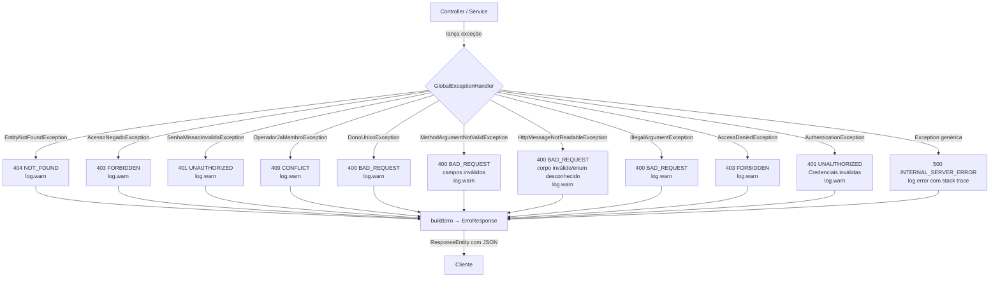

# Exception — Tratamento global de erros

## Visão geral

Todos os erros da API SatMonitor retornam um único formato JSON padronizado, independentemente de qual módulo lançou a exceção. Esse contrato é garantido pelo `GlobalExceptionHandler`, anotado com `@RestControllerAdvice`, que intercepta qualquer exceção não tratada pelos controllers antes que o Spring gere uma resposta padrão.

Benefícios dessa abordagem:
- O Mobile e o IoT consomem sempre a mesma estrutura de erro — sem surpresas no campo `error`.
- Novos módulos (missao, satelite, sensor, leitura) herdam o tratamento automaticamente sem nenhuma configuração adicional.
- O logging está centralizado: `WARN` para erros de negócio esperados, `ERROR` com stack trace apenas para erros inesperados.

---

## Formato do response

Todos os erros — de qualquer status HTTP — retornam este JSON:

```json
{
  "timestamp": "2026-06-01T14:32:07.123",
  "status": 404,
  "error": "Sensor não encontrado com id: 99",
  "path": "/sensores/99"
}
```

| Campo       | Tipo            | Descrição                                                  |
|-------------|-----------------|------------------------------------------------------------|
| `timestamp` | `LocalDateTime` | Momento exato em que o erro foi processado pelo handler    |
| `status`    | `int`           | Código HTTP numérico (400, 401, 403, 404, 409, 500…)       |
| `error`     | `String`        | Mensagem descritiva — da exceção ou texto fixo             |
| `path`      | `String`        | URI da requisição que gerou o erro (`req.getRequestURI()`) |

**Record Java:**

```java
public record ErroResponse(
    LocalDateTime timestamp,
    int status,
    String error,
    String path
) {}
```

---

## Exceções customizadas

| Classe                        | HTTP | Quando é lançada                                                  | Módulo que lança        |
|-------------------------------|:----:|-------------------------------------------------------------------|-------------------------|
| `EntityNotFoundException`     | 404  | Entidade não encontrada por ID (Missao, Satelite, Sensor, Leitura, Operador) | missao, satelite, sensor, leitura, auth |
| `AcessoNegadoException`       | 403  | Operador autenticado não tem role suficiente para a operação      | missao, satelite, sensor, leitura |
| `SenhaMissaoInvalidaException`| 401  | Operador tenta entrar em missão com senha errada                  | missao |
| `OperadorJaMembroException`   | 409  | Operador já é membro da missão e tenta entrar novamente           | missao |
| `DonoUnicoException`          | 400  | Único DONO tenta sair da missão sem transferir a propriedade      | missao |

Todas estendem `RuntimeException` — são `unchecked`, não precisam ser declaradas em assinaturas de método.

### Exemplos de uso

```java
// EntityNotFoundException
throw new EntityNotFoundException("Sensor não encontrado com id: " + id);
throw new EntityNotFoundException("Missão não encontrada com id: " + id);

// AcessoNegadoException
throw new AcessoNegadoException("Apenas o DONO pode excluir a missão");
throw new AcessoNegadoException("Role mínima exigida: SUPERVISOR");

// SenhaMissaoInvalidaException
throw new SenhaMissaoInvalidaException("Senha da missão incorreta");

// OperadorJaMembroException
throw new OperadorJaMembroException("Operador já é membro desta missão");

// DonoUnicoException
throw new DonoUnicoException("Transfira a propriedade antes de sair da missão");
```

---

## Fluxo de tratamento



---

## Ordem de tratamento

O Spring seleciona o handler mais específico compatível com a exceção lançada. A ordem declarada importa quando há ambiguidade (subclasses).

1. **`EntityNotFoundException`** — específica de domínio, 404. Declarada antes da genérica.
2. **`AcessoNegadoException`** — específica de domínio, 403. Declarada antes do `AccessDeniedException` do Spring Security para que mensagens customizadas do domínio sejam preservadas.
3. **`SenhaMissaoInvalidaException`** — específica de domínio, 401. Separada de `AcessoNegadoException` porque semanticamente é "credencial inválida" (401), não "sem permissão" (403).
4. **`OperadorJaMembroException`** — específica de domínio, 409. Indica conflito de estado — o recurso já existe nesse relacionamento.
5. **`DonoUnicoException`** — específica de domínio, 400. Indica requisição inválida pelo estado atual do sistema.
6. **`MethodArgumentNotValidException`** — framework (Bean Validation), 400. Extrai todos os campos inválidos e os formata em `"campo: mensagem; campo: mensagem"`. Deve vir antes de `IllegalArgumentException` pois é mais específica.
7. **`HttpMessageNotReadableException`** — framework (Jackson), 400. Corpo JSON malformado ou valor de enum desconhecido (ex.: `tipo` de sensor inválido no `SensorRequest`). Retorna `"Corpo da requisição inválido ou mal formatado"` — sem este handler, cairia no `Exception` e retornaria 500.
8. **`IllegalArgumentException`** — genérica da JDK, 400. Cobre casos de argumento inválido que não se encaixam nas exceções de domínio.
9. **`AccessDeniedException`** — do Spring Security, 403. Lançada pelo framework quando `@PreAuthorize` nega o acesso. Retorna sempre `"Acesso negado"` (sem expor detalhes de autorização).
10. **`AuthenticationException`** — do Spring Security, 401. Falha de login (`BadCredentialsException`, usuário inexistente) lançada por `authenticationManager.authenticate()` no `AuthController`. Retorna sempre `"Credenciais inválidas"` — mesma resposta para usuário inexistente e senha errada (anti-enumeração).
11. **`Exception`** — fallback final, 500. **Deve sempre ser a última.** Captura qualquer exceção não tratada. Loga `ERROR` com stack trace completo. Nunca expõe detalhes ao cliente.

> **Por que a ordem importa:** o Spring avalia os handlers de cima para baixo na classe. Se `Exception` viesse primeiro, ela capturaria todas as outras. Se `AccessDeniedException` viesse antes de `AcessoNegadoException`, o handler do Spring Security poderia engolir exceções de domínio (que estendem `RuntimeException`, não `AccessDeniedException` — neste caso não há risco, mas a convenção é: mais específico primeiro).

---

## Como adicionar nova exceção

Siga estes 4 passos ao precisar de um novo tipo de erro de domínio:

**1. Crie a classe da exceção em `exception/`:**

```java
package br.com.fiap.satmonitor.exception;

public class MinhaNovaException extends RuntimeException {
    public MinhaNovaException(String message) {
        super(message);
    }
}
```

Regras:
- Estende `RuntimeException` (unchecked).
- Apenas o construtor com `String message` — sem construtores extras.
- Sem `@ResponseStatus` na classe — o status é definido exclusivamente no handler.

**2. Adicione o handler no `GlobalExceptionHandler`, antes do handler de `Exception`:**

```java
@ExceptionHandler(MinhaNovaException.class)
public ResponseEntity<ErroResponse> handleMinhaNova(MinhaNovaException ex, HttpServletRequest req) {
    log.warn(ex.getMessage());
    return ResponseEntity.status(HttpStatus.UNPROCESSABLE_ENTITY)
            .body(buildErro(422, ex.getMessage(), req));
}
```

**3. Adicione a nova exceção à tabela de [Exceções customizadas](#exceções-customizadas) neste documento.**

**4. Faça o commit seguindo a convenção do projeto:**

```
feat: cria MinhaNovaException (422) para <situação>
```
