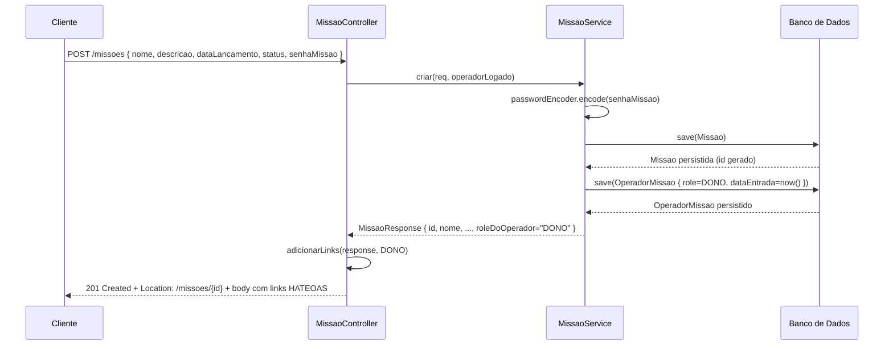
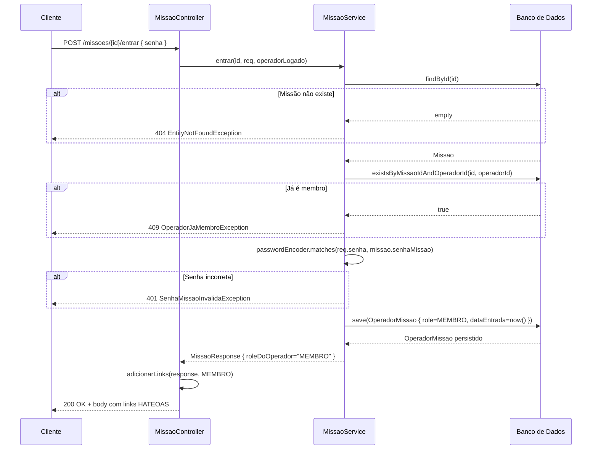

# Missao — Módulo de missões espaciais

## Índice

1. [Visão geral](#visão-geral)
2. [Entidades](#entidades)
3. [Roles](#roles)
4. [Endpoints](#endpoints)
5. [Fluxo de criação](#fluxo-de-criação)
6. [Fluxo de entrada via senha](#fluxo-de-entrada-via-senha)
7. [HATEOAS](#hateoas)
8. [Erros](#erros)

---

## Visão geral

Uma **Missão** agrupa satélites e operadores em torno de um objetivo espacial comum. Cada missão tem uma **senha**, que funciona como código de acesso — qualquer operador autenticado pode entrar em uma missão apresentando a senha correta via `POST /missoes/{id}/entrar`.

O operador que **cria** a missão torna-se automaticamente seu **DONO**, com acesso total. Os demais ingressam como **MEMBRO** e podem ser promovidos pelo DONO para **SUPERVISOR** ou **DONO**.

O controle de acesso é granular por operação e verificado em tempo de execução pelo `MissaoService`, usando a hierarquia de roles implementada no enum `RoleMissao.temPermissao(RoleMissao minimo)`.

---

## Entidades

### Missao (`TB_MISSAO`)

| Campo          | Tipo           | Restrição                  | Descrição                                            |
|----------------|----------------|----------------------------|------------------------------------------------------|
| `id`           | `Long`         | PK, sequence SEQ_MISSAO    | Identificador único                                  |
| `nome`         | `String`       | NOT NULL                   | Nome da missão                                       |
| `descricao`    | `String`       | CLOB (texto longo)         | Descrição detalhada da missão                        |
| `dataLancamento` | `LocalDate`  | NOT NULL                   | Data prevista ou efetiva de lançamento               |
| `status`       | `StatusMissao` | NOT NULL, STRING           | Estado atual: PLANEJADA, ATIVA ou ENCERRADA          |
| `senhaMissao`  | `String`       | NOT NULL, BCrypt           | Senha de acesso — nunca exposta em responses         |
| `operadorDono` | `Operador`     | FK, LAZY                   | Operador que criou a missão                          |
| `membros`      | `List<OperadorMissao>` | CASCADE ALL, orphanRemoval | Vínculos operador-missão com roles    |

### OperadorMissao (`TB_OPERADOR_MISSAO`)

Tabela de relacionamento N:N entre Operador e Missao, com role e data de entrada.

| Campo        | Tipo            | Restrição          | Descrição                                          |
|--------------|-----------------|--------------------|----------------------------------------------------|
| `operador`   | `Operador`      | PK composta (FK)   | Operador vinculado                                 |
| `missao`     | `Missao`        | PK composta (FK)   | Missão vinculada                                   |
| `role`       | `RoleMissao`    | NOT NULL, STRING   | Nível de acesso: DONO, SUPERVISOR ou MEMBRO        |
| `dataEntrada`| `LocalDateTime` | NOT NULL           | Momento em que o operador entrou na missão         |

A chave composta é gerenciada via `@IdClass(OperadorMissaoId)` com os campos `Long operador` e `Long missao`.

---

## Roles

`RoleMissao` é um enum com valores ordenados por nível de permissão. O ordinal é usado para comparação: DONO=0, SUPERVISOR=1, MEMBRO=2. Quanto menor o ordinal, maior a permissão.

`role.temPermissao(minimo)` → `this.ordinal() <= minimo.ordinal()`

| Ação                          | DONO | SUPERVISOR | MEMBRO |
|-------------------------------|:----:|:----------:|:------:|
| Ver missão                    | Sim  | Sim        | Sim    |
| Editar missão                 | Sim  | Não        | Não    |
| Excluir missão                | Sim  | Não        | Não    |
| Listar membros                | Sim  | Sim        | Sim    |
| Remover membro                | Sim  | Não        | Não    |
| Promover membro               | Sim  | Não        | Não    |
| Adicionar / editar satélite   | Sim  | Sim        | Não    |
| Excluir satélite              | Sim  | Não        | Não    |
| Adicionar / editar sensor     | Sim  | Sim        | Não    |
| Excluir sensor                | Sim  | Não        | Não    |
| Ver leituras                  | Sim  | Sim        | Sim    |
| Registrar leitura             | Sim  | Sim        | Sim    |
| Excluir leitura               | Sim  | Sim        | Não    |

---

## Endpoints

| Método   | Rota                              | Auth | Role mínimo | Descrição                                 |
|----------|-----------------------------------|:----:|:-----------:|-------------------------------------------|
| `POST`   | `/missoes`                        | Sim  | —           | Cria nova missão; criador vira DONO       |
| `GET`    | `/missoes`                        | Sim  | MEMBRO      | Lista missões onde o operador é membro    |
| `GET`    | `/missoes/{id}`                   | Sim  | MEMBRO      | Busca missão por id                       |
| `PUT`    | `/missoes/{id}`                   | Sim  | DONO        | Atualiza nome, descrição, data e status   |
| `DELETE` | `/missoes/{id}`                   | Sim  | DONO        | Exclui missão (cascade nos vínculos)      |
| `POST`   | `/missoes/{id}/entrar`            | Sim  | —           | Entra na missão via senha; role = MEMBRO  |
| `POST`   | `/missoes/{id}/sair`              | Sim  | MEMBRO      | Sai da missão                             |
| `GET`    | `/missoes/{id}/membros`           | Sim  | MEMBRO      | Lista todos os membros da missão          |
| `DELETE` | `/missoes/{id}/membros/{membroId}` | Sim | DONO        | Remove membro da missão                   |
| `PATCH`  | `/missoes/{id}/membros/{membroId}` | Sim | DONO        | Altera role do membro (`?novoRole=X`)     |

---

## Fluxo de criação

---

## Fluxo de entrada via senha

---

## HATEOAS

Todos os responses de `MissaoResponse` incluem links gerados pelo método `adicionarLinks(response, role)` no controller. Os links variam conforme o role do operador logado.

| Rel            | Método   | URL                                    | Disponível para     |
|----------------|----------|----------------------------------------|---------------------|
| `self`         | `GET`    | `/missoes/{id}`                        | Todos os roles      |
| `membros`      | `GET`    | `/missoes/{id}/membros`                | Todos os roles      |
| `sair`         | `POST`   | `/missoes/{id}/sair`                   | Todos os roles      |
| `atualizar`    | `PUT`    | `/missoes/{id}`                        | Apenas DONO         |
| `deletar`      | `DELETE` | `/missoes/{id}`                        | Apenas DONO         |

`MembroResponse` retorna um link `self` apontando para `GET /missoes/{id}/membros`.

---

## Erros

| Exceção                      | HTTP | Quando ocorre                                                       |
|------------------------------|:----:|---------------------------------------------------------------------|
| `EntityNotFoundException`    | 404  | Missão não encontrada pelo id informado                             |
| `EntityNotFoundException`    | 404  | Operador não é membro da missão ao tentar sair ou remover membro   |
| `EntityNotFoundException`    | 404  | Membro não encontrado na missão ao remover ou promover             |
| `AcessoNegadoException`      | 403  | Operador sem role suficiente (ex.: MEMBRO tentando editar missão)  |
| `AcessoNegadoException`      | 403  | Operador não é membro e tenta ver detalhes da missão               |
| `AcessoNegadoException`      | 403  | DONO tentando remover a si mesmo via `/membros/{id}` (use `/sair`) |
| `AcessoNegadoException`      | 403  | DONO tentando alterar a própria role via PATCH                     |
| `SenhaMissaoInvalidaException` | 401 | Senha informada não corresponde à senha da missão                  |
| `OperadorJaMembroException`  | 409  | Operador já é membro da missão e tenta entrar novamente            |
| `DonoUnicoException`         | 400  | Único DONO da missão tenta sair sem transferir a propriedade       |
