# MissaoService — Fluxos do service de missões

## Índice

1. [Visão geral](#visão-geral)
2. [Dependências injetadas](#dependências-injetadas)
3. [criar](#criar)
4. [listar](#listar)
5. [buscarPorId](#buscarpoid)
6. [atualizar](#atualizar)
7. [deletar](#deletar)
8. [entrar](#entrar)
9. [sair](#sair)
10. [listarMembros](#listarmembros)
11. [removerMembro](#removermembro)
12. [promoverMembro](#promovermembro)
13. [Helpers privados](#helpers-privados)
14. [Invariantes e decisões de design](#invariantes-e-decisões-de-design)

---

## Visão geral

`MissaoService` é o único service do módulo `missao/`. Ele centraliza toda a lógica de negócio relacionada ao ciclo de vida das missões e ao controle de membros. Cada método público corresponde diretamente a um endpoint do `MissaoController`.

As responsabilidades se dividem em três grupos:

| Grupo | Métodos |
|---|---|
| CRUD da missão | `criar`, `listar`, `buscarPorId`, `atualizar`, `deletar` |
| Acesso via senha | `entrar`, `sair` |
| Gestão de membros | `listarMembros`, `removerMembro`, `promoverMembro` |

---

## Dependências injetadas

```
MissaoService
 ├── MissaoRepository          — CRUD de Missao (JPA)
 ├── OperadorMissaoRepository  — CRUD e queries de OperadorMissao
 └── PasswordEncoder           — BCrypt para senhaMissao
```

`PasswordEncoder` é injetado aqui (e não no controller) porque a decisão de codificar e comparar senhas é regra de negócio, não infraestrutura de apresentação.

---

## criar

**Assinatura:** `criar(MissaoRequest req, Operador operadorLogado): MissaoResponse`  
**Transação:** `@Transactional` (leitura + escrita)

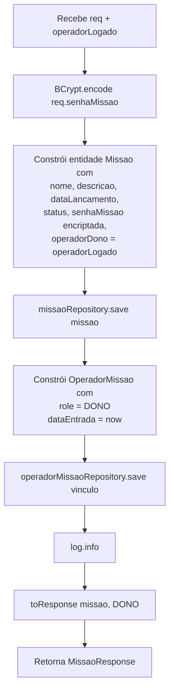

**Dois saves em sequência:** a missão é salva primeiro para obter o `id` gerado pela sequence. Só então o vínculo `OperadorMissao` é criado com a FK `missao_id` preenchida. Ambos ocorrem dentro da mesma transação.

**senhaMissao** é encriptada aqui antes de persistir — nunca é armazenada em texto puro.

---

## listar

**Assinatura:** `listar(Operador operadorLogado, Pageable pageable): Page<MissaoResponse>`  
**Transação:** `@Transactional(readOnly = true)`

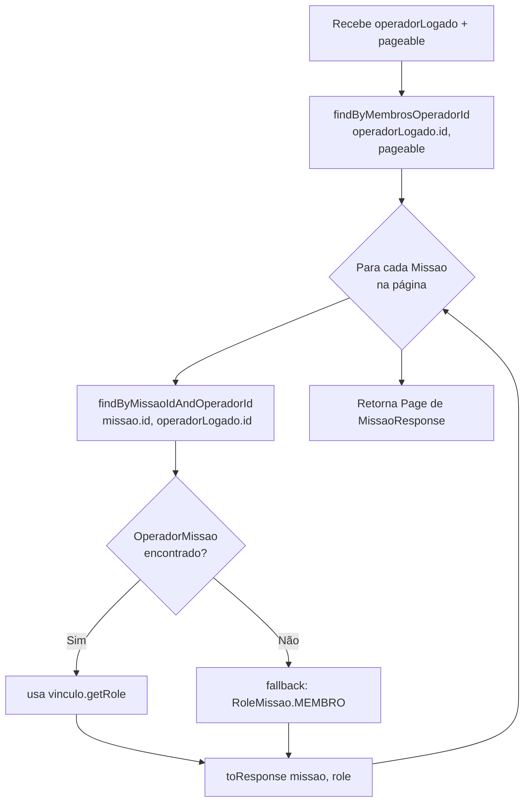

**Query derivada `findByMembrosOperadorId`:** navega pela associação `Missao.membros → OperadorMissao.operador.id`. O operador só vê missões onde já tem um vínculo registrado em `TB_OPERADOR_MISSAO`.

**Fallback para MEMBRO:** o `orElse(RoleMissao.MEMBRO)` na segunda query é um guard defensivo. Na prática, se a missão apareceu na primeira query, o vínculo existe. O fallback nunca deveria ser ativado.

**N queries por página:** para cada missão retornada, há uma segunda query para buscar o role. Para 10 missões, isso resulta em 11 queries (1 + 10). É um N+1 aceitável pelo tamanho da hierarquia do projeto, mas pode ser otimizado com uma query JPQL projetada se necessário.

---

## buscarPorId

**Assinatura:** `buscarPorId(Long id, Operador operadorLogado): MissaoResponse`  
**Transação:** `@Transactional(readOnly = true)`

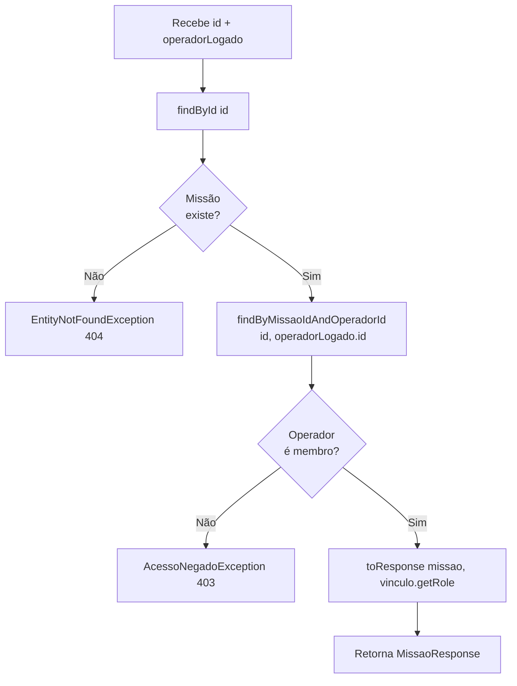

**Duas verificações independentes:** primeiro valida se a missão existe (404), depois se o operador tem acesso (403). A ordem importa: retornar 403 sem verificar se a missão existe vazaria a informação de que ela existe.

---

## atualizar

**Assinatura:** `atualizar(Long id, MissaoUpdateRequest req, Operador operadorLogado): MissaoResponse`  
**Transação:** `@Transactional`

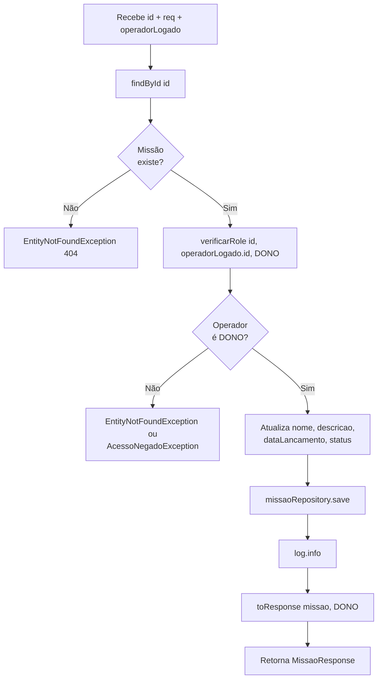

**`MissaoUpdateRequest` não tem `senhaMissao`:** a senha não é atualizável por este endpoint. A separação de DTOs (`MissaoRequest` vs `MissaoUpdateRequest`) é intencional — trocar a senha seria uma operação `PATCH /missoes/{id}/senha` separada.

**`verificarRole` pode lançar `EntityNotFoundException`** se o operador não for membro — não apenas `AcessoNegadoException`. Ver seção [verificarRole](#verificarrole).

---

## deletar

**Assinatura:** `deletar(Long id, Operador operadorLogado): void`  
**Transação:** `@Transactional`

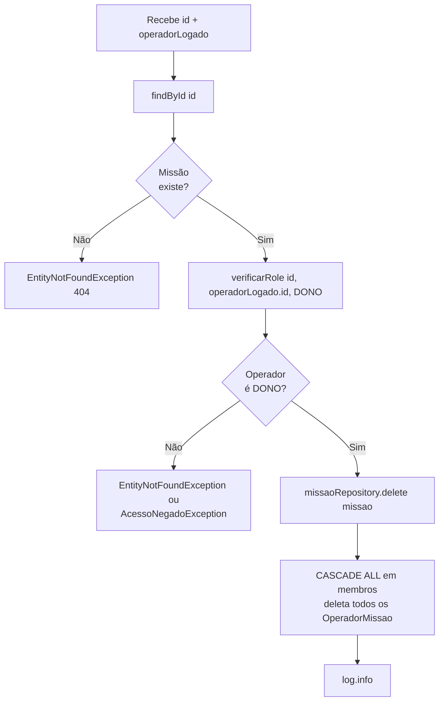

**Cascade automático:** `Missao.membros` tem `cascade = CascadeType.ALL, orphanRemoval = true`. Deletar a missão remove todos os vínculos `OperadorMissao` em cascata — sem precisar limpar manualmente.

---

## entrar

**Assinatura:** `entrar(Long id, EntrarMissaoRequest req, Operador operadorLogado): MissaoResponse`  
**Transação:** `@Transactional`

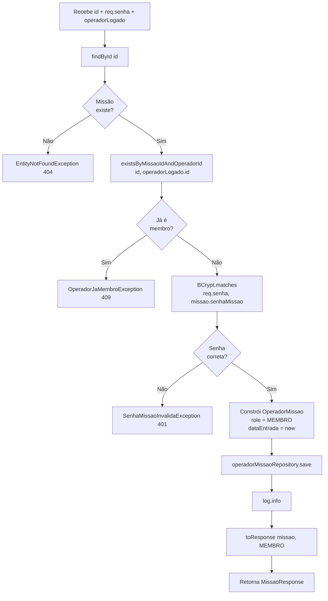

**Ordem das verificações importa:**

1. **Membros verificados antes da senha** — se o operador já é membro, retorna 409 imediatamente sem comparar a senha. Isso evita que um membro existente descubra se a senha mudou tentando entrar novamente.
2. **Senha comparada com BCrypt** — `passwordEncoder.matches()` compara o texto enviado com o hash armazenado. A senha nunca é descriptografada.
3. **Role inicial é sempre MEMBRO** — independente de quem entra. O DONO promove depois via `promoverMembro`.

---

## sair

**Assinatura:** `sair(Long id, Operador operadorLogado): void`  
**Transação:** `@Transactional`

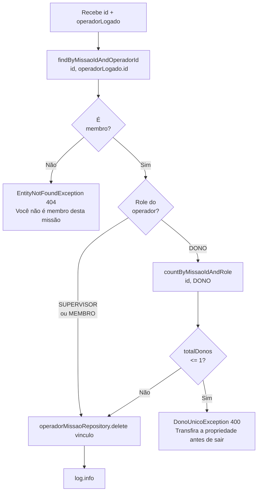

**Guard do DONO único:** a contagem de DONOs é feita somente quando o operador que está saindo é DONO. Supervisores e Membros saem diretamente. Se há pelo menos 2 DONOs, qualquer um pode sair livremente.

**`EntityNotFoundException` para não-membro:** diferentemente de `buscarPorId` (que lança `AcessoNegadoException`), `sair` lança `EntityNotFoundException`. A semântica é: "o vínculo que você está tentando desfazer não existe".

---

## listarMembros

**Assinatura:** `listarMembros(Long missaoId, Operador operadorLogado): List<MembroResponse>`  
**Transação:** `@Transactional(readOnly = true)`

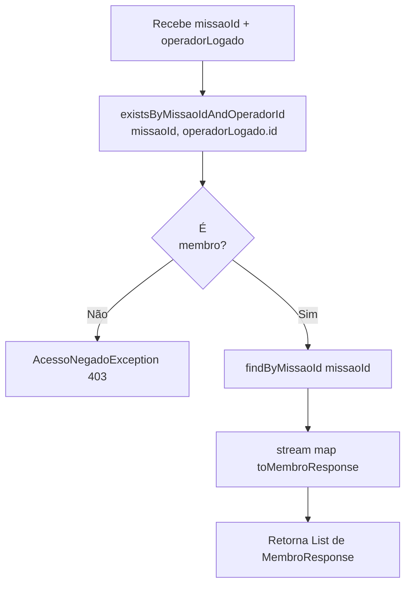

**Verificação simples de existência:** usa `existsBy...` em vez de `findBy...` — não precisa do objeto, só de confirmar o acesso. Isso é uma query `COUNT` no banco, mais eficiente que carregar o vínculo.

**Qualquer role tem acesso:** DONO, SUPERVISOR e MEMBRO podem listar membros. A restrição é apenas "ser membro".

---

## removerMembro

**Assinatura:** `removerMembro(Long missaoId, Long membroId, Operador operadorLogado): void`  
**Transação:** `@Transactional`

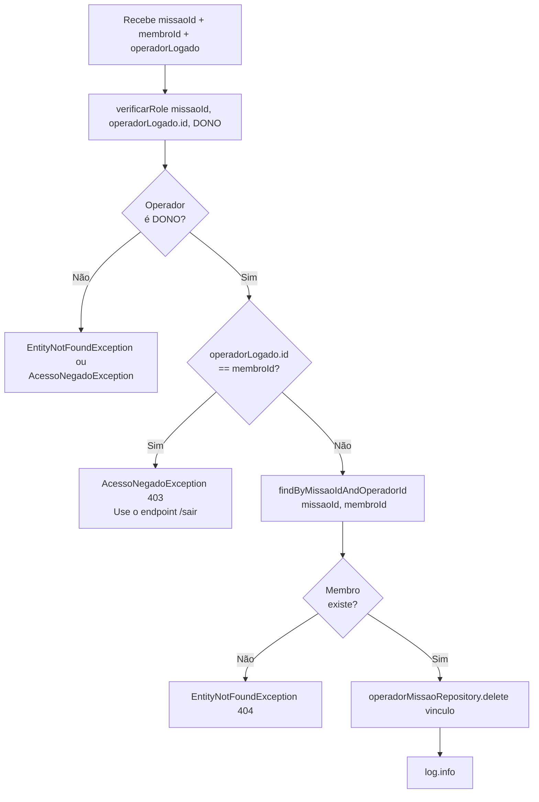

**Auto-remoção bloqueada:** o DONO não pode usar este endpoint para remover a si mesmo. A mensagem de erro orienta para o endpoint `/sair`, que tem a lógica correta de guarda do DONO único.

**Ordem: verificar role antes de verificar existência do membro** — isso evita que um não-DONO descubra se um determinado membro existe na missão através do código de resposta.

---

## promoverMembro

**Assinatura:** `promoverMembro(Long missaoId, Long membroId, RoleMissao novoRole, Operador operadorLogado): MembroResponse`  
**Transação:** `@Transactional`

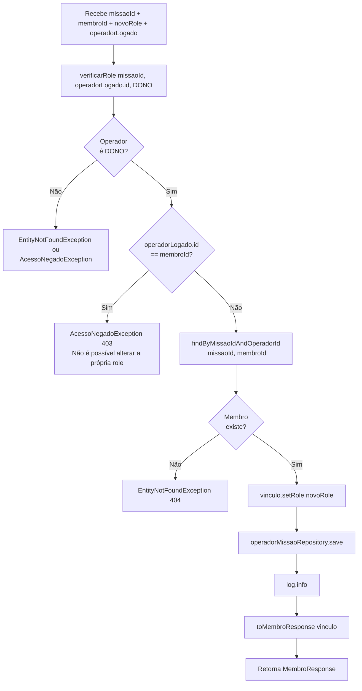

**`novoRole` pode ser qualquer valor do enum:** DONO, SUPERVISOR ou MEMBRO. O DONO pode promover alguém a DONO (criando um segundo DONO), rebaixar um SUPERVISOR para MEMBRO, etc. Não há validação de "direção" da promoção.

**Auto-promoção bloqueada:** análogo ao `removerMembro` — o DONO não pode alterar a própria role por aqui.

---

## Helpers privados

### verificarRole

```java
private void verificarRole(Long missaoId, Long operadorId, RoleMissao roleMinimo)
```

Usado por: `atualizar`, `deletar`, `removerMembro`, `promoverMembro`.

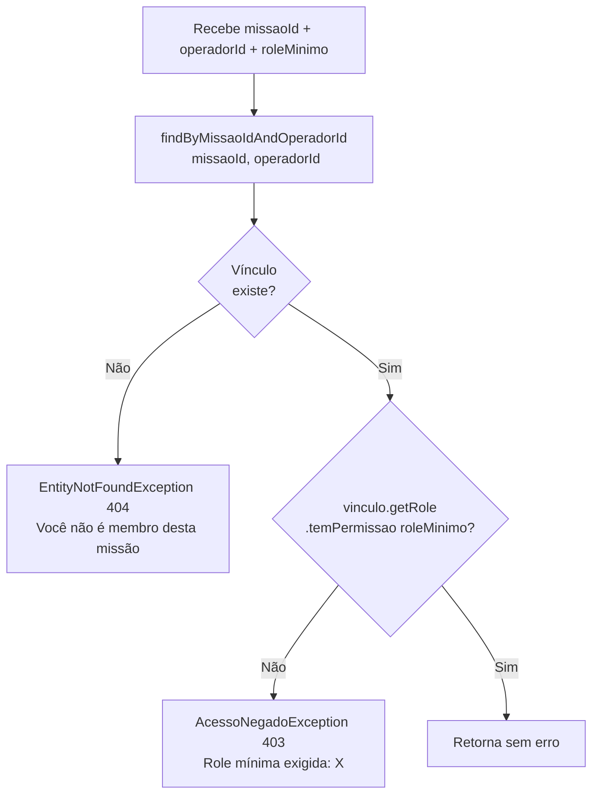

**Importante:** quando o operador não é membro, `verificarRole` lança `EntityNotFoundException` (404), não `AcessoNegadoException` (403). Isso é diferente do comportamento em `buscarPorId` e `listarMembros`, que lançam `AcessoNegadoException` diretamente.

A distinção é semântica: `verificarRole` verifica se um vínculo de autorização existe como pré-condição para uma operação destrutiva (atualizar, deletar, remover). Não encontrar o vínculo equivale a "esse recurso de autorização não existe".

**`temPermissao` por ordinal:** `RoleMissao.DONO=0`, `SUPERVISOR=1`, `MEMBRO=2`. A condição `this.ordinal() <= minimo.ordinal()` significa "eu tenho o mesmo nível ou mais permissão que o mínimo". Chamar `verificarRole(..., RoleMissao.SUPERVISOR)` aceita DONO e SUPERVISOR, mas rejeita MEMBRO.

---

### toResponse

```java
private MissaoResponse toResponse(Missao missao, RoleMissao roleDoOperador)
```

Mapeia `Missao` → `MissaoResponse`. Campos mapeados:

| Campo no Response | Fonte |
|---|---|
| `id` | `missao.getId()` |
| `nome` | `missao.getNome()` |
| `descricao` | `missao.getDescricao()` |
| `dataLancamento` | `missao.getDataLancamento()` |
| `status` | `missao.getStatus()` |
| `roleDoOperador` | `roleDoOperador.name()` — passado explicitamente pelo caller |
| `totalMembros` | `missao.getMembros().size()` |
| `totalSatelites` | `0` (hardcoded — aguarda integração com módulo satelite) |

**`senhaMissao` nunca aparece no response** — campo omitido intencionalmente.

**`totalMembros` depende da coleção lazy estar carregada.** Como `toResponse` é sempre chamado dentro de métodos `@Transactional`, a coleção é carregada on-demand sem `LazyInitializationException`. Em `criar`, a coleção está vazia (recém-persistida); `totalMembros` virá como 0 nesse momento, mas o vínculo do DONO existe no banco.

---

### toMembroResponse

```java
private MembroResponse toMembroResponse(OperadorMissao om)
```

Mapeia `OperadorMissao` → `MembroResponse`. Navega nas associações LAZY `om.getOperador()`:

| Campo no Response | Fonte |
|---|---|
| `operadorId` | `om.getOperador().getId()` |
| `nome` | `om.getOperador().getNome()` |
| `login` | `om.getOperador().getLogin()` |
| `role` | `om.getRole()` |
| `dataEntrada` | `om.getDataEntrada()` |

---

## Invariantes e decisões de design

### senhaMissao sempre em BCrypt
Encriptada em `criar` com `passwordEncoder.encode()`. Comparada em `entrar` com `passwordEncoder.matches()`. Nunca descriptografada, nunca retornada em response, nunca logada.

### Role inicial de qualquer novo membro é sempre MEMBRO
O fluxo `entrar` cria o vínculo com `RoleMissao.MEMBRO` fixo. Subir de nível é uma operação explícita do DONO via `promoverMembro`.

### DONO único não pode sair — mas pode existir mais de um DONO
A restrição é "pelo menos um DONO deve permanecer". Se houver 2 DONOs, ambos podem sair individualmente (um de cada vez). `promoverMembro` permite criar múltiplos DONOs.

### verificarRole lança EntityNotFoundException para não-membros
Chamado em operações destrutivas onde "não ser membro" é tratado como "o recurso de autorização não existe" (404), não "você não tem permissão" (403). Endpoints de leitura (`buscarPorId`, `listarMembros`) fazem a verificação diretamente e lançam `AcessoNegadoException`.

### Transações separadas de read/write
Métodos de leitura (`listar`, `buscarPorId`, `listarMembros`) usam `@Transactional(readOnly = true)`. Isso sinaliza ao JPA que não há dirty checking — o Hibernate não rastreia mudanças nos objetos carregados, reduzindo overhead. Operações de escrita omitem o `readOnly`.
